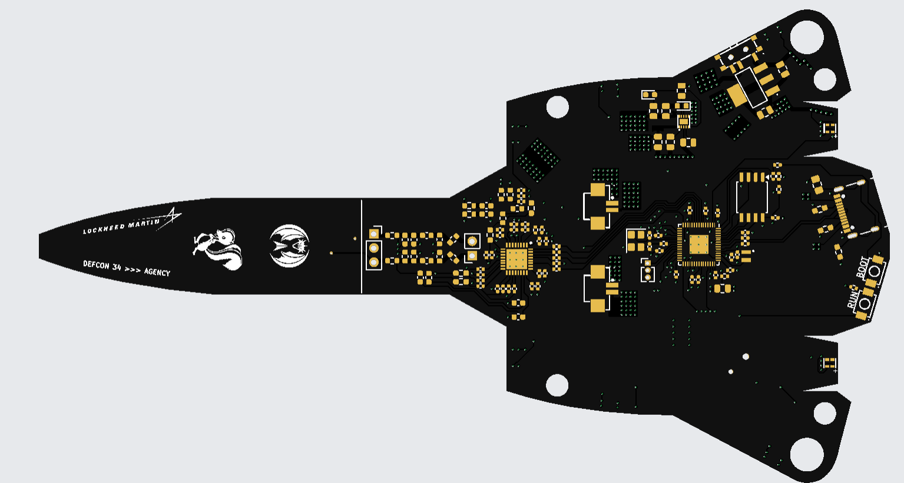
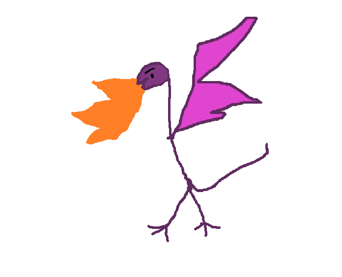

<h1>
SR-71 BADGE
</h1>

~A User Guide~

-----

A Lockheed Martin Aeronautics Cyber Range (ACR) project. 
Join us on <a href="https://discord.gg/sgUe73dNS8">discord</a>  

> Disclaimer
>> [!NOTE]
>> Everything about this badge was made using open-source and public information.
>>
>> This badge is for fun and educational purposes :smile:
-----
# DEF CON 34 ACR Badge User Guide

Welcome to the DEF CON 34 ACR badge. This guide covers powering and charging the badge, navigating the interface, collecting and trading cards, and changing badge settings.

## Quick Start

1. Turn on the badge using the switch on the underside of the right wing tip.
2. Let the startup animation finish.
3. Explore **Card Display**, **NFC Operations**, and **Settings** from the main menu.
4. Trade with other badge holders and scan official ACR stickers to grow your 39-card collection.

## Power, Charging, and Reset

### Turn the Badge On or Off

The power switch is located on the underside of the right wing tip. Move the switch to turn the badge on or off.

### Charge the Badge

Connect a USB-C cable to the badge.

| Indicator | Meaning |
|---|---|
| Red LED on | The badge is plugged into USB power. |
| Orange LED on | The battery is charging. |
| Orange LED off while still plugged in | The battery is fully charged. |

### Reset or Recover the Badge

If your badge needs to be reset or recovered, bring it to the ACR booth for help.

Reflashing and hardware or software modding are supported, but the badge firmware will not be released until sometime after DEF CON. Mod at your own risk. ACR cannot replace badges that are bricked while being modified or reflashed.

## Navigation

The main menu shows your collection progress as **Cards Unlocked: _x_/39** and provides three sections:

- **Card Display**
- **NFC Operations**
- **Settings**

On most screens, swipe up from the bottom edge to return to the main menu. Some screens also include an on-screen **Back** button.

Any touch wakes the display from low-power mode and restarts its inactivity timer.

## Card Collection

The badge contains 40 collectible cards.

- A new badge begins with three randomly selected product cards.
- Swipe left or right in **Card Display**, or use the side arrows, to browse the collection.
- Tap the centered card to open its details. Tap again to close the details.
- Locked cards show locked artwork and restricted information.
- Newly acquired cards play an unlock animation and are saved automatically.
- ACR cards have their own special visual treatment after they are acquired.

The badge rewards exploration and dedication. There may be more to discover in the interface and after completing your collection.

## NFC Antenna Placement

The best NFC contact point is where the aircraft canopy ends. Keep the devices steady at this location until the operation finishes.

- For badge-to-badge operations, align the canopy-end contact points on both badges.
- For an official ACR sticker, place the sticker against the badge at the canopy-end contact point.

> **Image placeholder:** Add a photo or diagram showing the NFC contact point where the canopy ends and the correct badge-to-badge alignment.

## NFC Operations

Open **NFC Operations** from the main menu. The badge supports **Peer to Peer**, **Gift Mode**, and **Tag Reader**.

Keep the badges or sticker aligned until the badge displays a result. Do not start another operation while an NFC operation is in progress.

### Peer-to-Peer Trade

Peer-to-peer mode exchanges one card in each direction.

1. Both users open **NFC Operations** and choose **Peer to Peer**.
2. Each user selects one eligible card to offer.
3. Start the trade on both badges.
4. Align the two badges at the canopy-end NFC contact point.
5. Keep both badges steady until the trade completes.

Trade rules:

- Each user must select an unlocked, owned, tradeable product card.
- ACR, sticker-only, and other non-tradeable cards cannot be offered.
- Each user must be receiving a card they do not already own.
- If either user already owns the incoming card, use **Gift Mode** instead.

When the trade succeeds, each badge shows the card it sent and the card it received.

### Gift Mode

Gift Mode sends a card without removing it from the sender's collection. It is also the correct mode when the recipient already owns the card.

#### Send a Gift

1. Open **NFC Operations** and choose **Gift Mode**.
2. Choose **Send a Gift**.
3. Select an eligible unlocked card.
4. Ask the other user to choose **Receive a Gift**.
5. Align both badges at the canopy-end NFC contact point.
6. Keep them steady until the transfer finishes.

#### Receive a Gift

1. Open **NFC Operations** and choose **Gift Mode**.
2. Choose **Receive a Gift**.
3. Align your badge with the sender's badge at the canopy-end contact point.
4. Keep both badges steady until the result appears.

Sending a gift does not remove the card from the sender. A recipient may receive a card they already own, but it will not create an additional copy in the collection.

### Tag Reader

Tag Reader unlocks cards from official ACR NFC stickers.

1. Open **NFC Operations** and choose **Tag Reader**.
2. Start the reader.
3. Hold the official ACR sticker at the canopy-end NFC contact point.
4. Keep it steady until the badge reports that the card was unlocked or already owned.

Only supported official ACR card stickers are accepted.

## Settings

Open **Settings** from the main menu to configure the LEDs, display, orientation, and low-power behavior. Changes are saved automatically.

### LED Configuration

Choose an LED pattern, color when supported by the selected pattern, and brightness.

Available patterns include:

- None
- Solid
- Rainbow
- Theater
- Scanner
- Breathe
- Twinkle
- Rainbow Breathe
- Flame
- Afterburner

LED brightness can be set from 10% to 100%. Selecting **None** turns the decorative LEDs off. Some patterns choose their own colors, so the color control is hidden when it does not apply.

You may find that the badge has more to offer as your collection grows.

### Display Brightness

- **UI Brightness** controls the normal screen brightness from 1% to 100%.
- **Ambient Brightness** controls the static logo brightness used in low-power mode from 10% to 100%.

### Orientation

Choose **Original** or **Flipped 180**. Changing the orientation saves the selection and restarts the badge interface.

### Low-Power Configuration

Choose what the display does after a period without touch input:

| Mode | Behavior |
|---|---|
| Disabled | The screen remains in normal operation. |
| Static Logo | The badge shows a low-brightness static logo. |
| Screen Off | The display backlight turns off. |

The inactivity timeout can be adjusted from 5 seconds to 1 minute. Touch the screen to wake the badge. Decorative LED behavior does not change when the display enters low-power mode, and low-power mode is paused during an active NFC operation.

## Hidden Features

Curiosity is encouraged. The badge contains one interface surprise, but finding it is part of the fun.

## Troubleshooting

### An NFC Trade Does Not Complete

- Confirm both users selected **Peer to Peer** and started the operation.
- Align both badges precisely where the canopy ends.
- Hold both badges still until a result appears.
- Confirm each user is receiving a card they do not already own.
- If the receiving user already owns the card, retry using **Gift Mode**.
- After an error or timeout, select **Try Again** and restart the operation on both badges.

### A Gift Does Not Complete

- Confirm one badge selected **Send a Gift** and the other selected **Receive a Gift**.
- Make sure the sender selected an eligible unlocked card.
- Realign both badges at the canopy-end NFC contact point and retry.

### A Sticker Does Not Scan

- Confirm **Tag Reader** is active.
- Place the official ACR sticker directly at the canopy-end NFC contact point.
- Hold the sticker steady until a result appears.
- Only supported official ACR card stickers can unlock cards.

### The Screen Is Darker Than It Should Be

- As the battery drains the screen backlight will have a dropoff in brightness. Charging the battery will fix this. The brightness setting adjusts based on battery level. 

### The Screen Is Dark/Black

- Touch the screen in case the badge entered low-power mode.
- Confirm the power switch on the underside of the right wing tip is on.
- Confirm LEDs are on.
- Connect USB-C power and check the charging indicators, in a very low power state the screen will be very dark or black. Sometimes during these very low battery modes there may be an OSError with hardware initialization. Charging the battery a bit more should fix this issue. 
- If the badge still does not respond, bring it to the ACR booth.

### LIVERY
<table>
<tr>
<td width="33%">
Lockheed logo 
</td>
<td width="33%">
ACR Team logo 
</td>
<td width="33%">
The unofficial team logo 
</td>
</tr>

<tr>
<td>

</td>

<td>

</td>
<td>

</td>
</tr>

<tr>
<td width="33%">
Skunkworks Skunk 
</td>
<td width="33%">
DEF CON 34 Theme slogan 
</td>
<td width="33%">
SR-71 Inspired Details 
</td>
</tr>

<td>

</td>
<td>

</td>

<td>

</td>
</tr>
</table>

-----

### The Badge Needs a Reset or Firmware Recovery

Bring the badge to the ACR booth. Firmware for user reflashing will be released sometime after DEF CON.

## Help and Support

For help, visit the ACR booth or join the [ACR Discord](https://discord.gg/DxGbpsKNtf).

